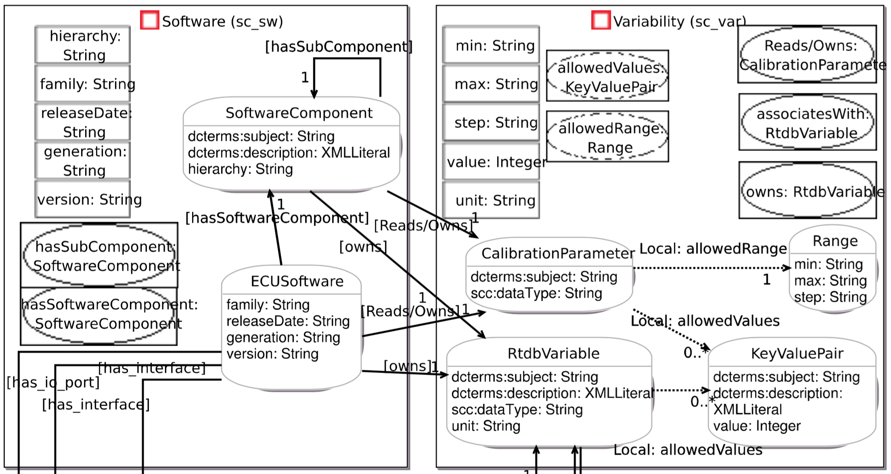

# oslc-schema-viewer
Extracts schema information from an OSLC provider and draws a Domain Specification View

## Overview
Starting with an OSLC catalog URL, this web application
- loads the catalog resource and uses it to find all resource types, domains and resource shapes
- draws a diagram of all domains, resource types and properties.




## OSLC Meta model

Parts relevant for this application.


## Metadata Retrieval Algorithm

- get the catalog
    - iterate over each service provider in it
        - for each service
            - for each QueryCapability and CreationFactory
                - get the resourceShape - save it
                    - for each property in it
                        - find out resource type by type of any found resource
                        - find out reference property target type by
                          1. oslc:range
                          1. type of target resource in instance

## Set up development environment

### Prerequisites

- access to https://github.com:FindOut/oslc-schema-viewer
- node installed - see https://nodejs.org
- git command line (optional)
- google chrome browser - Firefox and IE11+ will be supported later

### Checkout, build and run

```
git clone git@github.com:FindOut/oslc-schema-viewer.git
cd oslc-schema-viewer
npm install
npm start
```
The last command starts a proxy server and opens a web browser that after some seconds will show the Domain Specification View for the offis bugzilla OSLC catalog.

Currently, an OSLC site that requires authentication requires a username/password in a configuration file. The file local.config.json is automatically created by the proxy server, if missing. So at first start, edit the file and restart the server. The file has the followin contents:

```
{
 "auth": {
   "user": "your_username",
   "password": "your_password"}
}
```

If you dont have the git command line installed, you may download the code as a zip from the github web ui.
